VNT_AutodrivePlanner
---

# Mapeo y Planificación Global de Trayectorias en AutoDRIVE — LPA*

Este repositorio implementa un pipeline de mapeo y planificación global de trayectorias para el simulador **AutoDRIVE (F1TENTH)**, combinando mapeo del entorno mediante SLAM Toolbox (Parte A) con planificación global de trayectoria usando **LPA\* (Lifelong Planning A\*)** más suavizado con B-Spline, integrado en ROS 2 (Parte B).

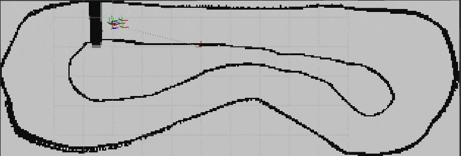

---
## 📁 Estructura del proyecto

```
.
├── README.md
├── .gitignore
├── videos/
├── img/                               
└── src/
    └── f1tenth_global_planner/
        ├── requirements.txt
        ├── package.xml
        ├── setup.py
        ├── setup.cfg
        ├── resource/
        │   └── f1tenth_global_planner
        ├── f1tenth_global_planner/
        │   ├── __init__.py
        │   ├── planner_node.py         # nodo ROS 2: LPA* sobre el mapa real
        │   ├── smoothing_node.py       # nodo ROS 2: suavizado B-Spline + generación de evidencias
        │   ├── grid_from_occupancy.py  # adaptador OccupancyGrid -> Grid, inflado, diagnóstico de corredor
        │   ├── smoothing.py            # funciones de ajuste/evaluación de spline
        │   └── python_motion_planning/ # librería vendorizada (implementación de LPA*)
        ├── launch/
        │   └── planning.launch.py      # map_server + lifecycle_manager + planner + smoother + rviz
        ├── config/
        │   ├── planning_params.yaml    # TODOS los parámetros ajustables del pipeline (ver sección dedicada)
        │   └── planning.rviz           # configuración de RViz2 con los displays ya armados
        ├── maps/
        │   ├── Autodrive_DefaultMap_obs.pgm         # mapa generado en Parte A
        │   └── Autodrive_DefaultMap_obs.yaml
        └── output/                     # NO se sube al repo (.gitignore) — se genera en cada ejecución
```
 
---

## ✅ Requisitos

| Componente | Versión / Detalle |
|---|---|
| Sistema operativo | Ubuntu 22.04 |
| ROS 2 | Humble |
| Python | 3.10 (venv recomendado) |
| AutoDRIVE Simulator | Ver [Tutorial 1: AutoDrive Installation and Setup](https://github.com/nabihandres/AUTODRIVE/blob/main/Tutorial%201%3A%20AutoDrive%20Installation%20and%20Setup.md) |
| Paquetes ROS 2 adicionales | `slam-toolbox`, `nav2-map-server`, `nav2-lifecycle-manager` |
| Dependencias Python | Ver [requirements.txt](./src/f1tenth_global_planner/requirements.txt) |

Instalación de paquetes ROS 2 del sistema:
 
```bash
sudo apt update
sudo apt install ros-humble-slam-toolbox ros-humble-nav2-map-server ros-humble-nav2-lifecycle-manager
```
---

## 📥 Clonación e instalación

Clona el repositorio en una carpeta aparte (no directamente dentro del workspace autodrive) y copia solo el paquete `f1tenth_global_planner` a `~/autodrive_ws/src`

```bash
cd ~/Downloads
git clone https://github.com/Gennalop/VNT_AutodrivePlanner f1tenth_project
cp -r f1tenth_project/src/f1tenth_global_planner ~/autodrive_ws/src/
```

Crea y activa el entorno virtual, e instala dependencias:

```bash
cd ~/autodrive_ws
python3 -m venv venv
source venv/bin/activate
pip install -r src/f1tenth_project/requirements.txt
```

Compila 

```bash
source /opt/ros/humble/setup.bash
colcon build --packages-select f1tenth_global_planner --symlink-install
source install/setup.bash
```

---

## ⚙️ Parámetros 

Los valores ajustables del sistema (margen de seguridad, tolerancia de suavizado, espaciados de waypoints, tamaño del zoom, etc.) están centralizados en un único archivo: [src/f1tenth_global_planner/config/planning_params.yaml](./src/f1tenth_global_planner/config/planning_params.yaml). Desde ahí podrás modificar:
 
| Parámetro | Nodo | Descripción |
|---|---|---|
| `clearance_m` | ambos (`/**`) | Margen de inflado de obstáculos (m), equivalente al radio de seguridad del vehículo. |
| `occ_threshold` | ambos (`/**`) | Umbral 0–100 para considerar una celda del `OccupancyGrid` como obstáculo. |
| `goal_topic` | `lpa_star_planner` | Tópico donde se recibe el goal (por defecto, el de "2D Goal Pose" de RViz). |
| `base_frame` / `map_frame` | `lpa_star_planner` | Frames TF usados para obtener la pose real del vehículo (start). |
| `expand_publish_every_n` | `lpa_star_planner` | Cada cuántos nodos nuevos explorados se publica `/expand_markers`. |
| `output_dir` | `path_smoother` | Carpeta donde se guardan CSVs e imágenes de cada corrida. |
| `smoothing_tolerance_m` | `path_smoother` | Tolerancia máxima de desviación de la spline respecto a los waypoints crudos. |
| `dense_samples` | `path_smoother` | Nº de puntos densos con los que se evalúa la spline (variante `original`). |
| `waypoint_spacings` | `path_smoother` | Lista de espaciados (m) a los que se remuestrea la ruta (variantes adicionales). |
| `zoom_radius_m` | `path_smoother` | Radio (m) del área ampliada en las imágenes de zoom comparativo. |
| `zoom_box_frac` | `path_smoother` | Tamaño del recuadro de zoom, como fracción de la figura (0.0–1.0). |

---

## ▶️ Ejecución

### Parte A — Mapeo (SLAM Toolbox)

Para el detalle completo del proceso de mapeado en 2D ver [Tutorial 3: Simultaneous Localization and Maping](https://github.com/nabihandres/AUTODRIVE/blob/main/Tutorial%203%3A%20Simultaneous%20Localization%20and%20Maping.md). A continuación se presenta un resumen de los pasos.

1. **Terminal 1 — Simulador:**
   ```bash
   cd ~/Downloads/AutoDRIVE_Sim
   ./"AutoDRIVE Simulator.x86_64"
   ```
   
2. **Terminal 2 — Bridge AutoDRIVE ↔ ROS 2:**
   ```bash
   cd ~/autodrive_ws
   source /opt/ros/humble/setup.bash && source venv/bin/activate && source install/setup.bash
   ros2 launch autodrive_f1tenth simulator_bringup_rviz.launch.py
   ```
   Espera 3–5 segundos a que `/clock`, `/tf` y el LiDAR empiecen a publicar. Y después, activar la conexión en el simulador AutoDRIVE desde su interfaz; debe pasar del estado Disconnected a Connected.

3. **Terminal 3 — Teleoperación:**
   ```bash
   cd ~/autodrive_ws
   source /opt/ros/humble/setup.bash && source venv/bin/activate && source install/setup.bash
   ros2 run autodrive_f1tenth teleop_keyboard
   ```
   
4. **Terminal 4 — SLAM Toolbox:**
   ```bash
   cd ~/autodrive_ws
   source /opt/ros/humble/setup.bash && source venv/bin/activate && source install/setup.bash
   CFG=$(realpath ~/autodrive_ws/src/f1tenth_project/slam_config/mapper_params_online_async.yaml)
   ros2 launch slam_toolbox online_async_launch.py slam_params_file:=$CFG use_sim_time:=true
   ```
4. **Terminal 5 — RViz2:**
    ```bash
   cd ~/autodrive_ws
   source /opt/ros/humble/setup.bash && source venv/bin/activate && source install/setup.bash
   rviz2
   ```

6. Mueve el vehículo lentamente por todo el circuito con las flechas del teclado hasta dar una vuelta por el mapa.

7. Guarda el mapa desde el panel `SlamToolboxPlugin` en RViz (botón **Save Map**), apuntando a:
   ```
   ~/autodrive_ws/src/f1tenth_project/src/f1tenth_global_planner/maps/Autodrive_DefaultMap_obs
   ```
   Esto genera `Autodrive_DefaultMap_obs.pgm` y `Autodrive_DefaultMap_obs.yaml`.

### Parte B — Planificación global (LPA\*) + suavizado

Con el simulador y el bridge de la Parte A **ya corriendo** (pasos 1 y 2 de arriba):

1. **Terminal nueva — Pipeline de planificación:**
   ```bash
   cd ~/autodrive_ws
   source /opt/ros/humble/setup.bash && source venv/bin/activate && source install/setup.bash
   ros2 launch f1tenth_global_planner planning.launch.py
   ```
   
2. En RViz, usa la herramienta **"2D Goal Pose"** y haz clic en cualquier punto libre del mapa.

3. Verás en tiempo real:
   - `/expand_markers` — nodos explorados por LPA\* mientras busca la ruta.
   - `/raw_path` — ruta cruda encontrada por LPA\*.
   - `/smoothed_path` — ruta suavizada con B-Spline.
---

## 📂 Salidas generadas por corrida
 
Cada vez que se define un goal, se crea una carpeta con marca de tiempo:
 
```
output/<timestamp>/
├── maps/
│   ├── map_raw.png                              # mapa tal cual llega de /map, sin procesar
│   ├── map_inflated_clearance_0.25m.png          # mapa después de inflar obstáculos (clearance_m)
│   └── corridor_width_debug.png                  # mapa de calor de distancia a obstáculos + cuello de botella
├── path_original/
│   ├── waypoints_path_original.csv                # waypoints de la ruta suavizada (~1000 puntos densos)
│   ├── path_original.png                          # solo ruta cruda (LPA*)
│   ├── path_original_smooth.png                   # solo ruta suavizada
│   ├── path_original_overlap.png                  # ambas superpuestas
│   ├── path_original_zoom.png                     # zoom comparativo en el punto de mayor curvatura
│   └── path_original_curvature.png                # curvatura vs. distancia recorrida, cruda vs. suavizada
├── path_0.5m/
│   └── (mismos archivos que arriba, remuestreados a 0.5 m)
└── path_1.0m/
    └── (mismos archivos que arriba, remuestreados a 1.0 m)
```

---

## 📊 Resultados
 
Las imágenes de esta sección corresponden a una corrida de ejemplo

### 1. Mapa antes y después del procesamiento
 
| Mapa crudo (`/map`) | Mapa inflado (`clearance_m`) | Diagnóstico de ancho de corredor |
|---|---|---|
| 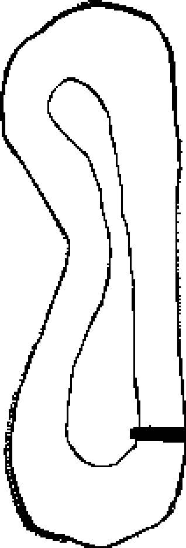 |  | 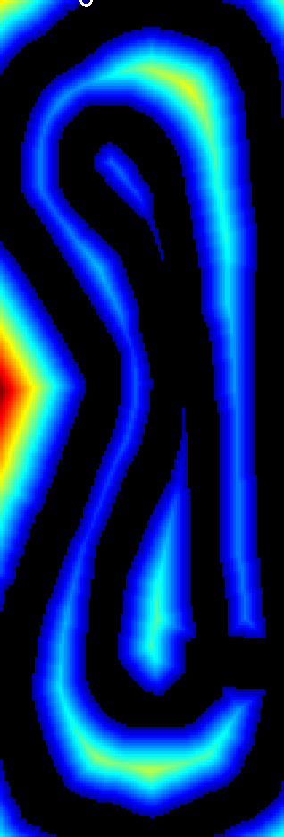 |

### 2. Ruta cruda vs. suavizada vs. superpuesta (por variante)
 
| Variante | Ruta cruda (LPA\*) | Ruta suavizada (spline) | Superpuesta |
|---|---|---|---|
| `path_original` | 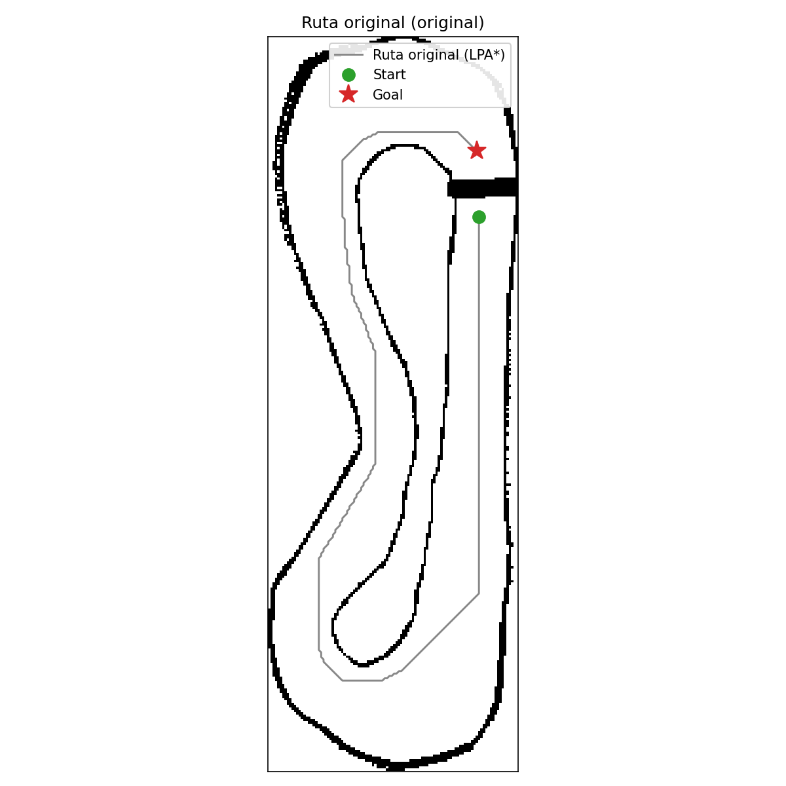 | 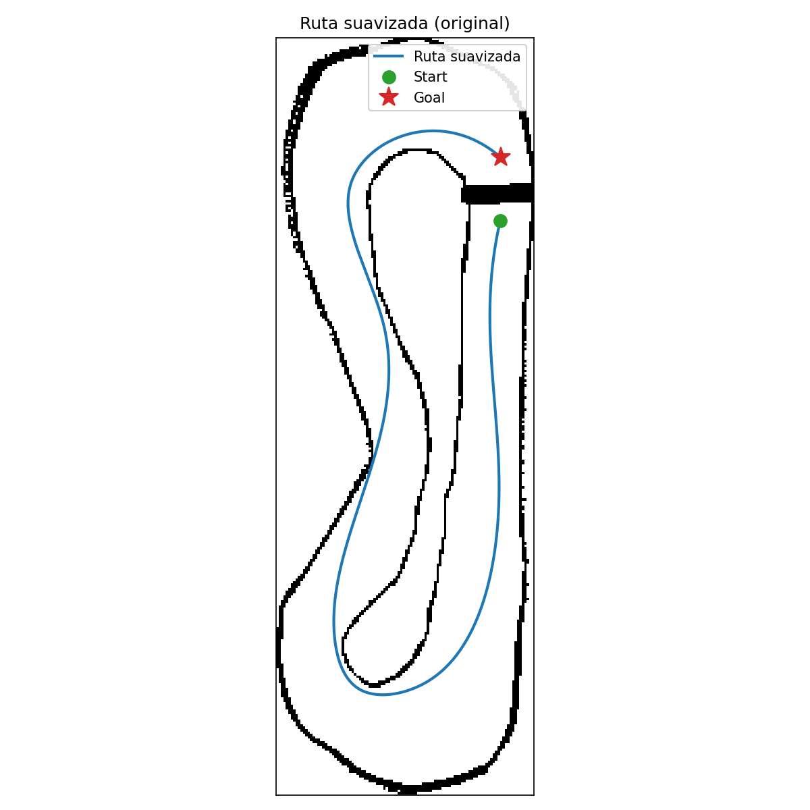 | 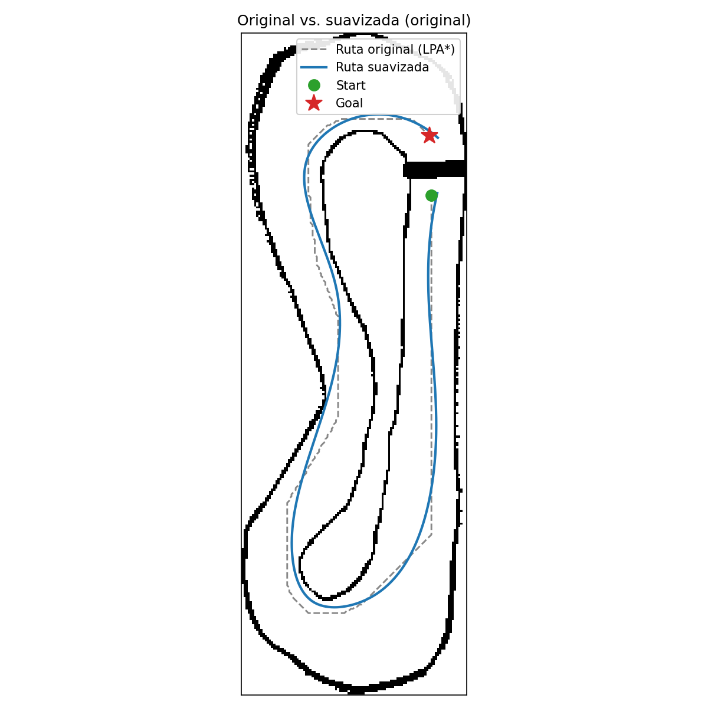 |
| `path_0.5m` | 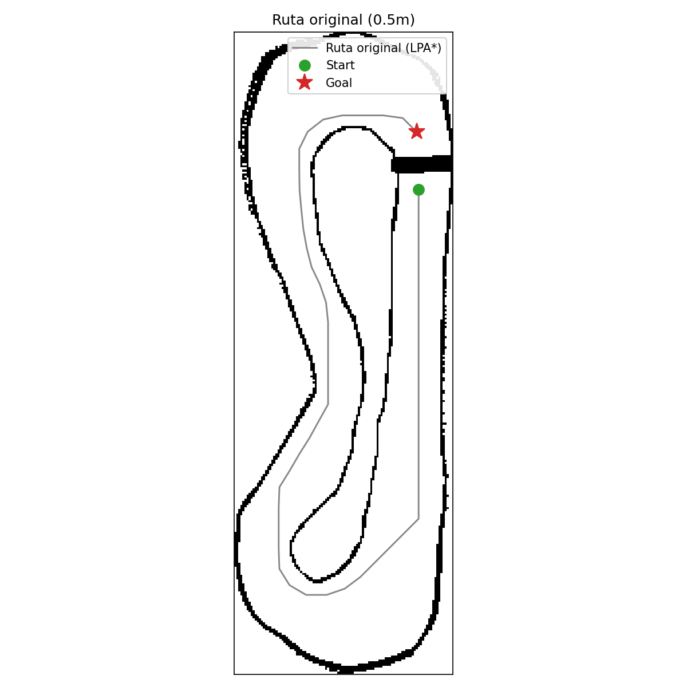 | 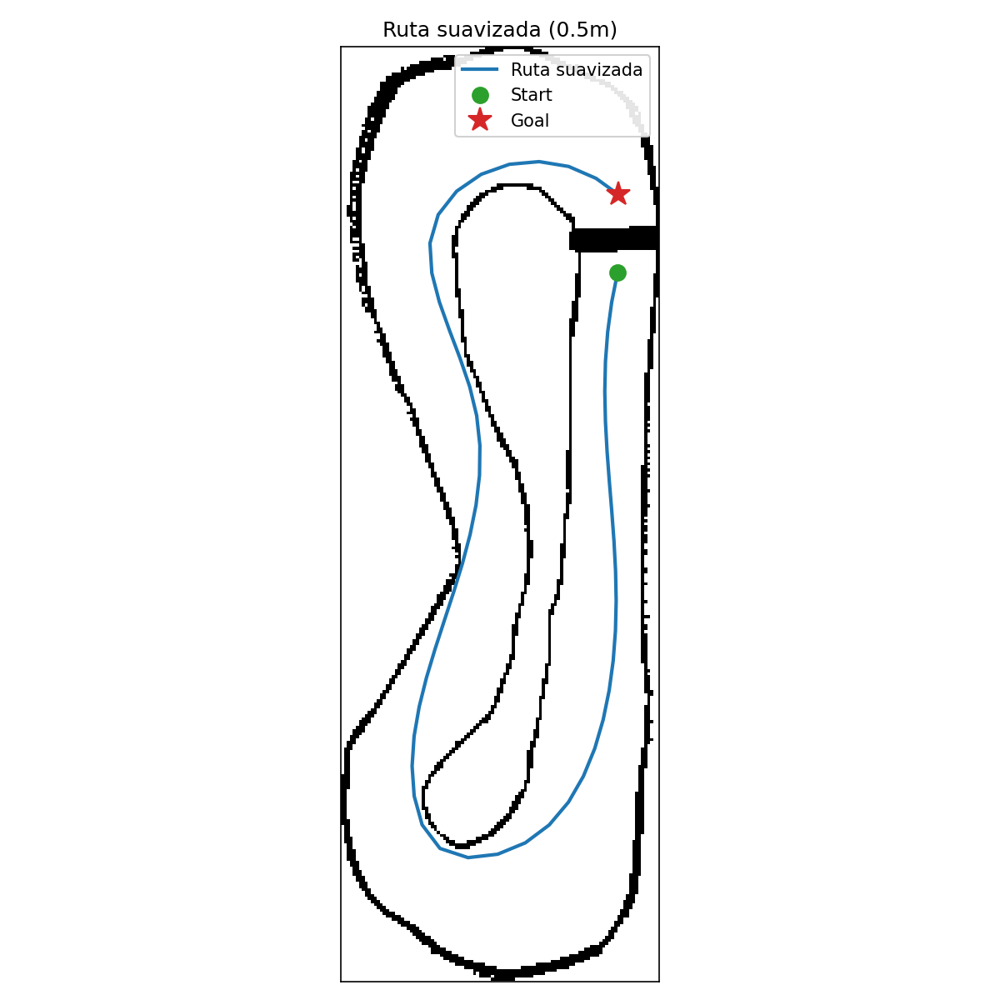 | 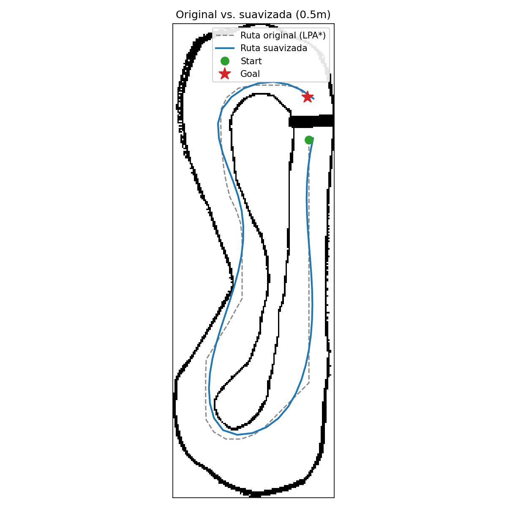 |
| `path_1.0m` |  |  |  |

### 3. Zoom 
 
| `path_original` | `path_0.5m` | `path_1.0m` |
|---|---|---|
| 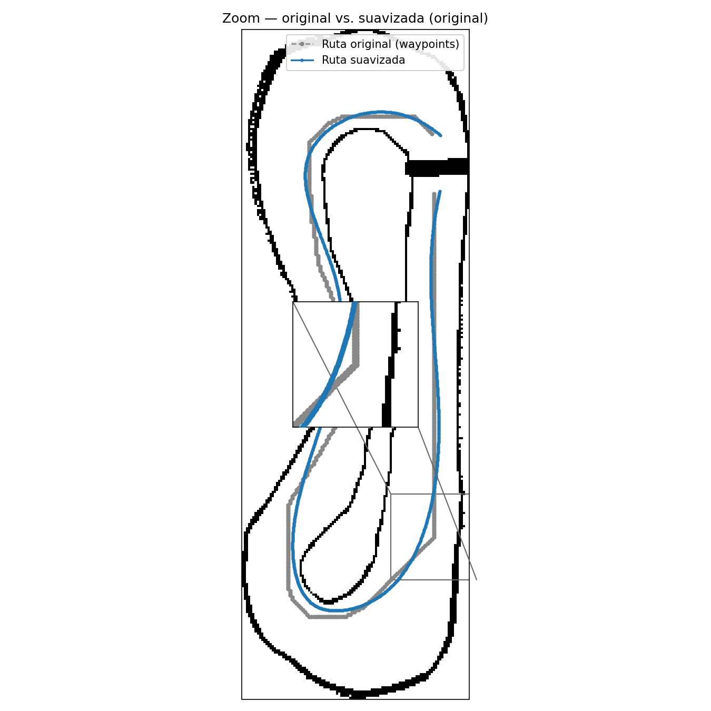 | 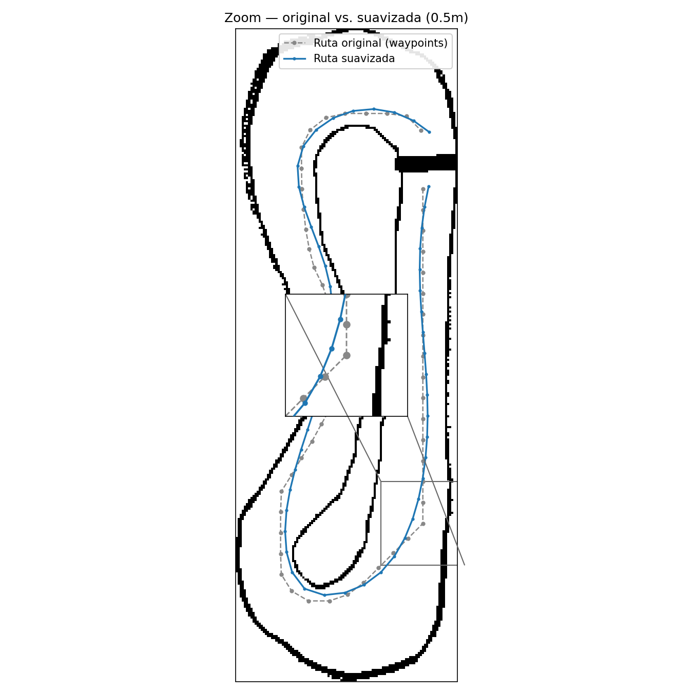 | 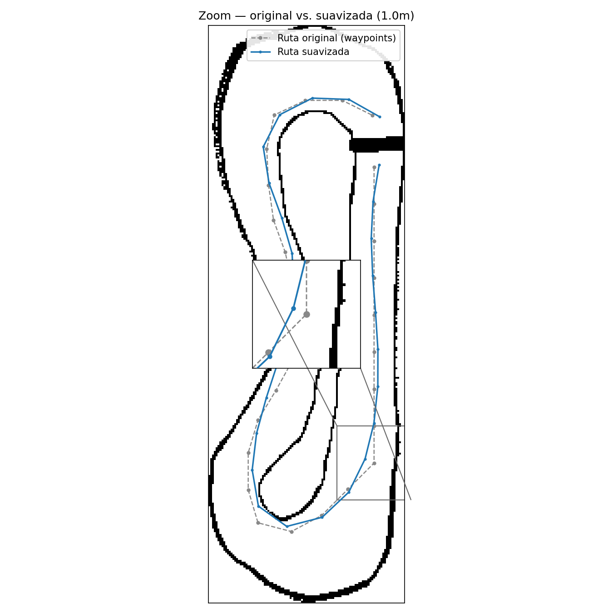 |

---

## 🎥 Videos y evidencias

Mapeo del entorno: https://youtu.be/Yo-HIwkqQ_o
Planificador global: https://youtu.be/OJrK6Sc1XWk

---

## 🧠 Descripción de los algoritmos, variables importantes y modificaciones realizadas

### Algoritmo de planificación: LPA\* (Lifelong Planning A\*)

LPA\* es una variante incremental de A\* pensada para entornos que cambian dinámicamente: en vez de recalcular la ruta completa desde cero ante un cambio en el mapa, reutiliza información de búsquedas previas (valores `g` y `rhs` por nodo) para actualizar solo la porción afectada. En este proyecto se usa la implementación de la librería [`python_motion_planning`](https://github.com/ai-winter/python_motion_planning) (vendorizada dentro de `f1tenth_global_planner/f1tenth_global_planner/python_motion_planning/`).

### Suavizado: B-Spline

La ruta cruda que entrega LPA\* (secuencia de celdas discretas) se convierte a coordenadas del mundo y se ajusta con una spline suave mediante `scipy.interpolate` (`smoothing.py`), controlada por una tolerancia de desviación máxima respecto a los waypoints originales.

### Variables importantes

| Variable | Ubicación | Descripción |
|---|---|---|
| `occ_threshold` | `grid_from_occupancy.py` | Umbral de probabilidad (0–100) a partir del cual una celda del `OccupancyGrid` se considera obstáculo. |
| `SMOOTHING_TOLERANCE_M` | `smoothing_node.py` | Tolerancia máxima (en metros) que la spline puede desviarse de los waypoints crudos. |
| Frame de lookup de TF | `planner_node.py` → `get_start_world()` | `map → f1tenth_1`; define de dónde se toma la pose de inicio real del vehículo. |
