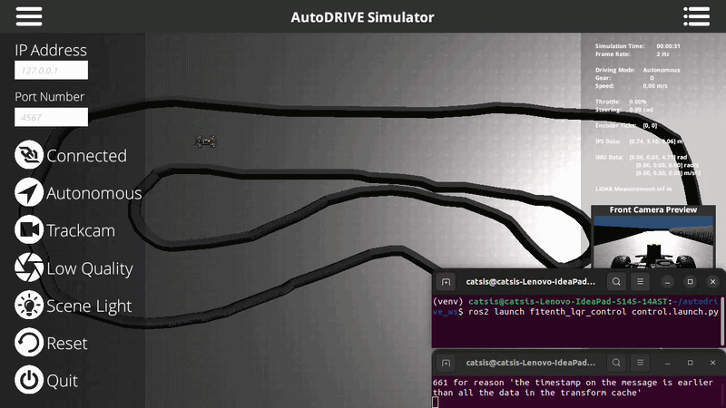

# Seguimiento de Trayectorias y Control LQR en AutoDRIVE

Paquete ROS 2 que implementa un controlador **LQR (Linear Quadratic Regulator)** para que el vehículo F1TENTH siga de forma autónoma la trayectoria global suavizada, generada en la Parte 1 del proyecto, dentro del simulador AutoDRIVE.



---

## 🔗 Relación con la Parte 1

Este paquete **no reemplaza** al de planificación, lo consume:

El nodo puede tomar la trayectoria de referencia de dos formas:
- **En vivo**, suscribiéndose a `/smoothed_path` (requiere tener corriendo `f1tenth_global_planner` — Parte 1 — en paralelo).
- **Desde un CSV** ya exportado (por ejemplo, `waypoints_path_original.csv` generado por `smoothing_node` en la Parte 1), útil para repetir pruebas sin tener que replanificar cada vez.

---

## 📁 Estructura del paquete

```
f1tenth_lqr_control/
├── package.xml
├── setup.py
├── setup.cfg
├── resource/
│   └── f1tenth_lqr_control
├── f1tenth_lqr_control/
│   ├── __init__.py
│   └── lqr_controller_node.py     # nodo principal: LQR + conteo de vueltas + cronómetro
├── launch/
│   └── lqr_control.launch.py      # (pendiente de crear — ver Ejecución)
└── config/
    └── lqr_params.yaml            # (pendiente de crear — ver Ejecución)
```

---

## ✅ Requisitos

Los mismos de la Parte 1, sin dependencias nuevas:

| Componente | Detalle |
|---|---|
| ROS 2 | Humble |
| Python | 3.10 (mismo venv de la Parte 1) |
| Dependencias Python | `numpy` (ya la tienes instalada) |
| Paquete previo | `f1tenth_global_planner` compilado y funcional (Parte 1), si se usa `/smoothed_path` en vivo |

No se requiere `scipy`/`matplotlib`/`osqp`/etc. para este paquete.

---

## 📥 Clonación e instalación

Si este paquete vive en el mismo repositorio que `f1tenth_global_planner`:

```bash
cd ~/autodrive_ws/src/f1tenth_project
git pull   # o clona de nuevo si es la primera vez
```

Debe quedar junto al otro paquete:

```
~/autodrive_ws/src/f1tenth_project/src/
├── f1tenth_global_planner/
└── f1tenth_lqr_control/
```

---

## 🔨 Compilación

```bash
cd ~/autodrive_ws
source /opt/ros/humble/setup.bash
source venv/bin/activate
colcon build --packages-select f1tenth_lqr_control --symlink-install
source install/setup.bash
```

---

## ⚙️ Parámetros

| Parámetro | Tipo | Default | Descripción |
|---|---|---|---|
| `csv_path` | string | `''` | Ruta a un CSV de waypoints (`x,y`) para cargar la trayectoria offline. Si está vacío, el nodo se suscribe a `/smoothed_path` en vivo. |
| `debug` | bool | `True` | Activa logs detallados por ciclo de control (índice de waypoint, errores, ganancia LQR, alertas de posible choque/atasco). |
| `target_speed_mps` | double | `1.2` | Velocidad usada dentro del modelo linealizado (afecta las matrices `A`/`B` del LQR), **no** es un lazo de velocidad cerrado — ver [Limitaciones](#-limitaciones-conocidas--pendientes). |
| `throttle_limit` | double | `0.2` | Valor constante de throttle que se publica en cada ciclo (comando de aceleración en lazo abierto). |

---

## 🔌 Tópicos

### Suscripciones

| Tópico | Tipo | QoS | Uso |
|---|---|---|---|
| `/smoothed_path` | `nav_msgs/Path` | `TRANSIENT_LOCAL` | Trayectoria de referencia (solo si `csv_path` está vacío) |
| `/autodrive/f1tenth_1/ips` | `geometry_msgs/Point` | default | Posición real del vehículo (x, y) — también se usa para fijar la línea de meta y estimar velocidad |
| `/autodrive/f1tenth_1/imu` | `sensor_msgs/Imu` | default | Orientación real del vehículo (yaw, extraído del cuaternión) |

### Publicaciones

| Tópico | Tipo | Rango | Uso |
|---|---|---|---|
| `/autodrive/f1tenth_1/steering_command` | `std_msgs/Float32` | `[-0.5, 0.5]` rad | Comando de dirección calculado por el LQR |
| `/autodrive/f1tenth_1/throttle_command` | `std_msgs/Float32` | constante = `throttle_limit` | Comando de aceleración (lazo abierto) |

---

## ▶️ Ejecución

Con el simulador AutoDRIVE y el bridge ya corriendo (igual que en la Parte 1), en una terminal nueva:

**Opción A — trayectoria en vivo desde `/smoothed_path`** (requiere `f1tenth_global_planner` corriendo en paralelo y un goal ya seleccionado en RViz):

```bash
cd ~/autodrive_ws
source /opt/ros/humble/setup.bash && source venv/bin/activate && source install/setup.bash
ros2 run f1tenth_lqr_control lqr_controller_node
```

**Opción B — trayectoria fija desde CSV** (recomendada para repetir la prueba de 10 vueltas de forma consistente, sin depender de volver a hacer clic en RViz cada vez):

```bash
ros2 run f1tenth_lqr_control lqr_controller_node --ros-args \
  -p csv_path:="/ruta/a/tu/waypoints_path_original.csv"
```

El nodo arranca el lazo de control a 20 Hz (`dt = 0.05 s`) apenas recibe la primera posición vía `/autodrive/f1tenth_1/ips` y tiene una trayectoria cargada.

---

## 🧠 Algoritmo

### Modelo de error y LQR

En cada ciclo, el nodo:
1. Busca el waypoint más cercano de la trayectoria a la posición actual del vehículo.
2. Calcula el **error lateral** (`e_y`, distancia perpendicular a la trayectoria) y el **error de orientación** (`e_yaw`, diferencia entre el yaw real y el yaw de referencia en ese punto).
3. Linealiza la dinámica del error alrededor de la velocidad objetivo (`target_speed_mps`), con matrices:
   ```
   A = [[1, v·dt], [0, 1]]
   B = [[0], [(v·dt) / wheelbase]]
   ```
4. Resuelve la ganancia LQR `K` mediante iteración de la ecuación de Riccati (`solve_lqr`, hasta 50 iteraciones o convergencia con tolerancia `1e-3`), con matrices de costo `Q = diag([2.0, 1.0])` (penaliza más el error lateral que el de orientación) y `R = diag([0.5])` (costo del esfuerzo de control).
5. El comando de steering es `-K @ [e_y, e_yaw]`, saturado a `[-0.5, 0.5]` rad.

### Cierre de circuito

`process_and_close_path` conecta el último punto de la trayectoria con el primero (interpolación lineal si el hueco es mayor a 0.1 m) y calcula el yaw de referencia de cada tramo con `atan2` entre puntos consecutivos — así el LQR puede seguir la pista de forma continua, vuelta tras vuelta, sin que el vehículo "se pierda" al llegar al final del CSV/path original.

- **Parámetros aún no centralizados en YAML** (a diferencia de la Parte 1) — pendiente si se quiere mantener consistencia con el resto del proyecto.
- **Sin archivo de `launch`** — actualmente se ejecuta con `ros2 run` directo; considera armar un `launch/lqr_control.launch.py` si el flujo de arranque se vuelve repetitivo (por ejemplo, para lanzarlo junto con Parte 1 en un solo comando).

## Video de ejecución
https://youtu.be/NijfYExO67U
